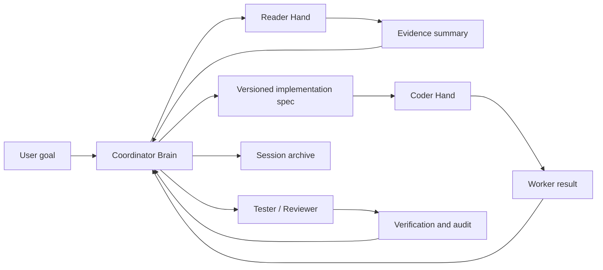

# MindHandsHarness

Protocol-first managed agents for separating the coordinator brain from worker hands.

[中文说明](README.zh-CN.md)

MindHandsHarness is a lightweight local harness for running multi-agent coding workflows without building a full orchestration platform. It gives one model the role of **Coordinator Brain** and moves reading, coding, testing, reviewing, and memory curation into isolated **Worker Hands**.

The goal is simple: keep the main model's context clean, make worker behavior explicit, and leave an auditable trail of what happened.

> Status: early protocol-first project. The harness is usable, but the public API and file layout may still evolve.

## Why MindHandsHarness

Most agentic coding sessions blur planning, exploration, editing, and testing into one context. That works for small tasks, but it becomes noisy when the work grows. The coordinator starts reading too much code, execution details crowd out decisions, and it becomes hard to reconstruct why something happened.

MindHandsHarness introduces a small control plane:

- **Coordinator Brain** plans, decides, delegates, and summarizes.
- **Reader Hand** collects evidence with file paths and line references.
- **Coder Hand** implements a frozen spec, not vibes.
- **Tester Hand** verifies behavior without patching code.
- **Reviewer Hand** audits scope and spec compliance.
- **Memory Curator** proposes stable knowledge updates.

It is not a replacement for your coding agent. It is a set of rails, files, and CLI commands that make agent collaboration more reliable.

## Core Idea



## What It Provides

- A protocol-first workflow for human-in-the-loop agent teams.
- A local CLI for session, mission, task, spec, archive, and health state.
- Role prompts for Coordinator, Reader, Coder, Tester, Reviewer, and Memory Curator.
- Versioned implementation specs to prevent workers from executing mutable drafts.
- Per-task artifacts so repeated Reader/Coder runs do not overwrite each other.
- JSONL session events for auditability.
- A minimal regression test suite for harness behavior.

## Quick Start

Clone or copy this repository into a project where you want to use the harness.

```bash
python3 .harness/bin/harness.py status
```

Start a mission:

```bash
python3 .harness/bin/harness.py start "Investigate and implement the requested change"
```

Dispatch a Reader with narrow questions:

```bash
python3 .harness/bin/harness.py dispatch-role \
  --role Reader \
  --objective "Locate the files and current behavior relevant to the requested change" \
  --questions "Which file owns the behavior?; What are the exact insertion points?; What risks or unknowns remain?"
```

Print worker instructions:

```bash
python3 .harness/bin/harness.py worker-instructions
```

Open a new agent window and paste the printed instruction. When the worker replies `Completed.`, collect the result:

```bash
python3 .harness/bin/harness.py collect-role --role Reader
```

If the evidence is sufficient, create and validate the implementation spec:

```bash
python3 .harness/bin/harness.py write-spec
# Edit .harness/runtime/current/implementation_spec.md
python3 .harness/bin/harness.py spec-check
```

Dispatch the Coder:

```bash
python3 .harness/bin/harness.py dispatch-role \
  --role Coder \
  --objective "Implement the checked implementation spec"
```

After testing and review, archive the mission:

```bash
python3 .harness/bin/harness.py archive-current
```

## Healthy Mission Cycle

```text
start
  -> dispatch Reader
  -> worker-instructions
  -> collect Reader
  -> evidence sufficiency check
  -> write-spec
  -> edit implementation_spec.md
  -> spec-check
  -> dispatch Coder
  -> collect Coder
  -> dispatch Tester/Reviewer when needed
  -> archive-current
```

Use `status` when the next step is unclear. Use `doctor` before claiming the harness state is healthy.

## Repository Layout

```text
.harness/
  bin/harness.py                 # CLI for session, task, spec, archive, health
  roles/                         # Role prompts for brain and hands
  protocols/                     # Task, result, memory, session, planning protocols
  memory/                        # Project memory categories
  worker_bootstrap.md            # One-shot worker startup instructions
  state.json                     # Current harness state
  test_harness_cli.py            # Regression tests
AGENTS.md                        # Entry point instructions for AI agents
docs/                            # Human-facing documentation
```

Runtime artifacts are created under `.harness/runtime/`, `.harness/sessions/`, and `.harness/tasks/`. These are ignored by Git by default.

## Design Principles

- **Brain stays clean**: the coordinator should not drown in raw logs or broad code exploration.
- **Workers are bounded**: each worker receives a role, a task packet, and an output format.
- **Facts before specs**: the Coder should not execute until the Coordinator has evidence and a checked spec.
- **Specs are frozen**: `spec-check` creates versioned snapshots so execution is auditable.
- **Artifacts are preserved**: repeated workers get unique task IDs and per-task result files.
- **Humans stay in charge**: the harness prepares prompts and state, but you decide when to run workers and approve outcomes.

## Documentation

- [Quick Start](docs/quickstart.md)
- [Architecture](docs/architecture.md)
- [Workflow Protocol](docs/workflow-protocol.md)
- [Open Source Release Checklist](docs/open-source-release-checklist.md)
- Chinese docs: [快速开始](docs/quickstart.zh-CN.md), [架构说明](docs/architecture.zh-CN.md), [工作流协议](docs/workflow-protocol.zh-CN.md)

## Project Name

**MindHandsHarness** means the mind and the hands are deliberately separated:

- Mind: planning, decisions, evidence checks, spec writing.
- Hands: reading, editing, testing, reviewing, memory proposals.

The name also leaves room for future integrations beyond local manual workers.

## Visual Assets

Image assets are intentionally not included yet.

Planned assets:

- Project icon or logo.
- Exported workflow diagram for social previews and README hero use.

For now, the README uses Mermaid diagrams so the repository remains lightweight and editable.

## Development

Run regression tests:

```bash
python3 .harness/test_harness_cli.py
```

Run syntax checks:

```bash
PYTHONPYCACHEPREFIX=/tmp/mindhandsharness_pycache \
  python3 -m py_compile .harness/bin/harness.py .harness/test_harness_cli.py
```

Run health check:

```bash
python3 .harness/bin/harness.py doctor
```

## License

MIT. See [LICENSE](LICENSE).
