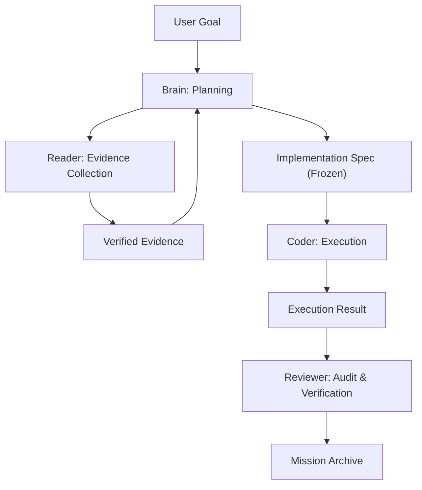

# MindHandsHarness

**Protocol-first managed agents. Separating the Brain from the Hands.**

[中文说明](README.zh-CN.md)

MindHandsHarness is a lightweight local protocol designed to run multi-agent coding workflows with surgical precision. It prevents context pollution by enforcing a strict boundary between the **Coordinator Brain** (planning and decisions) and specialized **Worker Hands** (reading, editing, testing).

## The Philosophy

Context is finite; discipline is infinite. Most agentic sessions fail because the model drowns in its own logs, broad code exploration, and execution noise. 

MindHandsHarness solves this by:
1. **Isolation**: Execution details stay in worker sessions.
2. **Evidence-First**: No code is changed until evidence is verified.
3. **Frozen Specs**: Every implementation follows a versioned, immutable specification.

## Core Roles

- **Coordinator Brain**: Frames the goal, validates evidence, writes the spec, and audits the results.
- **Reader Hand**: A specialized scout that gathers line references and answers narrow questions.
- **Coder Hand**: A pure execution role that implements the frozen spec. No strategy, just implementation.
- **Tester/Reviewer**: Verification roles that ensure the "hands" did exactly what the "brain" intended.

## The Workflow Loop

## Quick Start (Chat-Based)

Using MindHandsHarness is as simple as talking to your AI. You don't need to learn a CLI—the AI handles the protocol for you.

1. **Invite the AI**: Copy this repository into your project.
2. **Start a Mission**: Simply tell the AI your goal: *"Use the harness to refactor the login logic."*
3. **Follow the Lead**: The AI will automatically initialize the mission, dispatch a Reader to investigate, and ask you to trigger sub-agents when needed.

## Repository Structure

- `.harness/`: The heart of the protocol. Contains roles, state management, and CLI logic.
- `AGENTS.md`: The entry point for AI agents. **Do not modify.**

