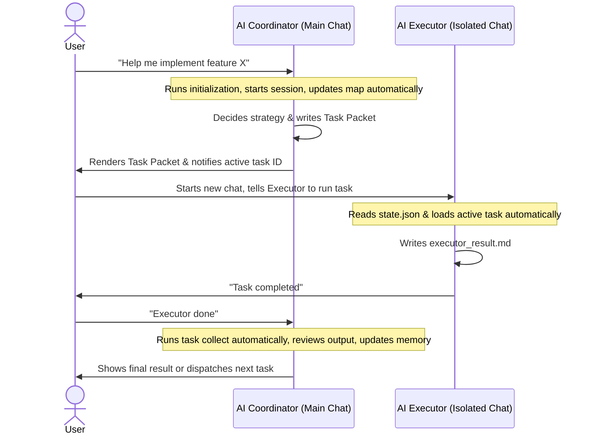
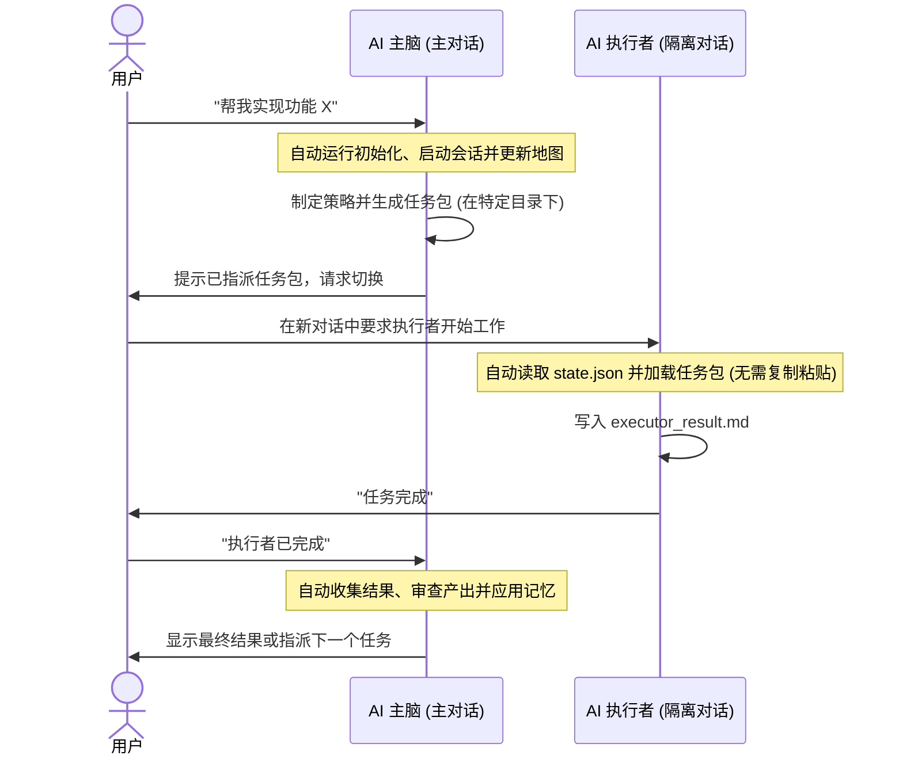

<p align="center">
  <a href="#english">English</a> | <a href="#chinese">简体中文</a>
</p>

<p align="center">
  
</p>

<h1 align="center" id="english">MindHandsHarness (English)</h1>

<p align="center">
  <strong>A specification-driven Coordinator-Executor workflow designed for zero-overhead AI software engineering.</strong>
</p>

MindHandsHarness is an engineering governance protocol that separates strategic planning from mechanical execution. By isolating context-heavy work, it ensures that your AI assistant remains structured, precise, and highly cost-effective even as the codebase grows.

---

# 🛑 Why? The "Drunken Walk" Problem

As AI coding sessions grow longer, you inevitably hit the following **Core Pain Points**:
* **Context Pollution**: The AI gets lost in its own chat history and execution logs, leading to hallucinations and forgotten requirements.
* **Silent Architecture Creep**: A coder agent starts a small change and ends up redesigning the database because it "thought it was better."
* **Spec Drift**: The code drifts from original intent because there is no externalized "source of truth" outside the chat window.
* **Token Explosion**: You pay for massive, repetitive garbage context on every single turn.

---

# 💡 The Solution: Zero-User CLI Automation

MindHandsHarness v2 is structured so that **you (the user) do not execute CLI commands**. 
The AI model reads `AGENTS.md` and automatically executes the harness scripts (`.harness/bin/harness.py`) behind the scenes using its internal tools. 

The harness relies on a clean, decoupled two-role process:
* 🧠 **Coordinator (主脑)**: Owns planning, context gatekeeping, and strategic decisions. It automatically tracks progress, refreshes the project map, and creates tasks.
* 🛠 **Executor (执行者)**: Operates within isolated, one-shot sessions to read, write, or test code within strict bounds.

---

# 🚀 Quick Start for Users

Integrating MindHandsHarness into your project takes less than 30 seconds:

### 1. Copy to your project root
Clone this repository and copy the protocol engine to your own project:
```bash
cp -r .harness /path/to/your/project/
cp AGENTS.md /path/to/your/project/
```

### 2. Just Chat
Open your AI editor (Cursor, Claude Code, Gemini, etc.) and simply describe your goal:
> "Please follow the `AGENTS.md` protocol to implement JWT authentication."

*Under the hood, the AI Coordinator will automatically initialize the harness skeleton, start a session, index the project map, and guide you through the process.*

---

# 🔄 Interactive Flow & Conversation Guide

Here is what happens when you start a new goal and how you collaborate with the Coordinator:



### 💬 1. Starting a New Conversation
Simply state your goal in a fresh chat. The Coordinator will:
1. Initialize the harness (runs `harness.py init` if it hasn't been run).
2. Start the session (runs `harness.py start "<your_goal>"`).
3. Load the boot status.
4. Prepare the strategic plan.

### 👥 2. Handoff: Running the Subordinate (Executor)
When the Coordinator decides on a complex implementation task, it will package the details into a Task Packet and write it to the active task directory.

> [!IMPORTANT]
> **How to execute the subordinate's task**:
> 1. The Coordinator will notify you: *"I have dispatched task `T-20260519-001`. Please run the Executor in a new chat window."*
> 2. Open a **new chat session** in your AI editor (this ensures the worker has a clean, noise-free context).
> 3. Simply type: *"Executor, start the active task"* or similar.
> 4. The Executor will **automatically locate and load** the active task configuration from `.harness/runtime/state.json` and the task packet.
> 5. The Executor will perform the task, write the results to `.harness/runtime/sessions/<session_id>/tasks/<task_id>/executor_result.md`, and notify you when complete.
> 6. Close the worker chat. Return to the **original Coordinator chat** and tell the Coordinator: *"Executor is done"* or *"Task complete"*.
> 7. The Coordinator will automatically run `harness.py task collect` to read and integrate the results.

This simple handoff prevents token explosion and ensures your primary chat history remains concise and focused on high-level goals.

---

# 📂 Protocol Directory Structure

* `.harness/`
  * `bin/harness.py`: The State Manager. Automates coordination, tasks, and memory.
  * `context/`: Holds `project-status.md` and `project-map.md` (updated automatically).
  * `roles/`: Defines rules for `coordinator.md` and `executor.md`.
  * `policies/`: Governance rules for context loading, memory, and external skills.
  * `memory/`: Externalized strategic memory (lessons, decisions, and files).
  * `runtime/`: Session logs, active task packets, and worker output.
* `AGENTS.md`: The AI constitution and CLI router.

<br/>
<br/>

---

<p align="center">
  
</p>

<h1 align="center" id="chinese">MindHandsHarness (简体中文)</h1>

<p align="center">
  <strong>规范驱动的 主脑-执行者 工作流，专为零用户开销的 AI 软件工程设计。</strong>
</p>

MindHandsHarness 是一套工程治理协议，它通过将战略规划与具体执行分离，并在独立的单次会话中运行高上下文子任务，确保 AI 助手在代码库膨胀时依然能保持条理、精准并大幅削减 Token 成本。

---

# 🛑 为什么需要？解决“醉汉漫步”问题

随着 AI 编程对话的延长，你不可避免地会遇到以下**核心痛点**：
* **上下文污染**：AI 迷失在冗长的聊天记录和执行日志中，导致幻觉丛生，甚至忘记最初的需求。
* **架构黑盒化**：编程 Agent 在重构一小块逻辑时，往往会因为“觉得这样更好”而私自重构你的整个数据库或系统设计。
* **实现偏离意图**：由于没有会话之外的“事实来源”，最终代码往往与你的原始意图渐行渐远。
* **Token 费用爆炸**：为了让 AI 保持状态，你每一轮对话都在为大量重复的垃圾上下文买单。

---

# 💡 解决方案：零用户 CLI 命令自动化

在 MindHandsHarness v2 中，**你（用户）不需要执行任何 CLI 命令**。
AI 模型在读取 `AGENTS.md` 后，会自动在后台通过其工具运行 harness 脚本 (`.harness/bin/harness.py`) 来同步状态。

Harness 依赖于以下两个角色的分离：
* 🧠 **主脑 (Coordinator)**：负责策略决策、规划、上下文看门以及持久化记忆。它会自动跟踪进度、更新项目地图并创建任务包。
* 🛠 **执行者 (Executor)**：在隔离的、单次的会话中运行，在严格限制的目录下读取、修改或测试代码。

---

# 🚀 快速开始

在你的现有项目中集成 MindHandsHarness 仅需不到 30 秒：

### 1. 复制到项目根目录下
克隆本仓库，并将协议引擎和宪法文件移动到你的项目根目录下：
```bash
cp -r .harness /你的/项目/路径/
cp AGENTS.md /你的/项目/路径/
```

### 2. 直接对话
在你的项目中打开 AI 编辑器（Cursor, Claude Code, Gemini 等），直接说出你的目标即可：
> “请遵循 `AGENTS.md` 协议来实现 JWT 身份验证。”

*主脑（Coordinator）在后台会自动完成初始化、开启会话、更新项目地图并引导您进行协作。*

---

# 🔄 交互流程与会话指南

以下是启动新目标时的协作流程：



### 💬 1. 新开对话时的操作
在全新的聊天窗口中直接向主脑提出你的任务需求。主脑会自动完成以下操作：
1. 初始化 Harness 骨架（如果未初始化则自动运行 `harness.py init`）。
2. 开启新会话（自动运行 `harness.py start "<任务目标>"`）。
3. 加载启动上下文与当前状态。
4. 产出实现规划。

### 👥 2. 主脑指派手下干活时，用户要怎么做？
当主脑决定将复杂的修改或测试工作分派给执行者时，它会生成一个任务包并保存在活跃的任务目录下。

> [!IMPORTANT]
> **如何运行执行者任务**：
> 1. 主脑会提示你：*"我已指派任务 `T-20260519-001`。请在新对话窗口中运行执行者。"*
> 2. 在 AI 编辑器中打开一个**全新的聊天窗口**（这确保了执行者拥有绝对干净、无噪声的上下文）。
> 3. 在新窗口中输入：*"执行者，开始任务"*。
> 4. 执行者会通过 `AGENTS.md` 协议，**自动读取** `.harness/runtime/state.json` 确定当前活跃任务包，并在隔离环境下执行修改。
> 5. 执行者完成后，会将结果写入 `executor_result.md` 并通知你。
> 6. 关闭执行者聊天窗口。回到**主脑所在的对话窗口**，直接发送：*"执行者已完成"* 或 *"任务完成"*。
> 7. 主脑会在后台自动运行 `harness.py task collect` 收集并解析结果，更新项目地图和工程记忆。

通过这种方式，你的主对话能够始终专注于顶层策略和目标，而不会被数千行的构建日志和操作细节所淹没。

---

# 📂 协议目录结构

* `.harness/`
  * `bin/harness.py`：状态管理器，自动化处理协作、任务包和工程记忆。
  * `context/`：存放 `project-status.md` 和 `project-map.md`（自动更新维护）。
  * `roles/`：定义 `coordinator.md` 和 `executor.md` 的角色规范。
  * `policies/`：定义上下文加载限制、记忆同步以及技能使用策略。
  * `memory/`：持久化工程意图与决策（ lessons, decisions, files ）。
  * `runtime/`：运行时的会话日志、活跃的任务包以及执行者的输出。
* `AGENTS.md`：AI 的宪法与 CLI 路由指南。
