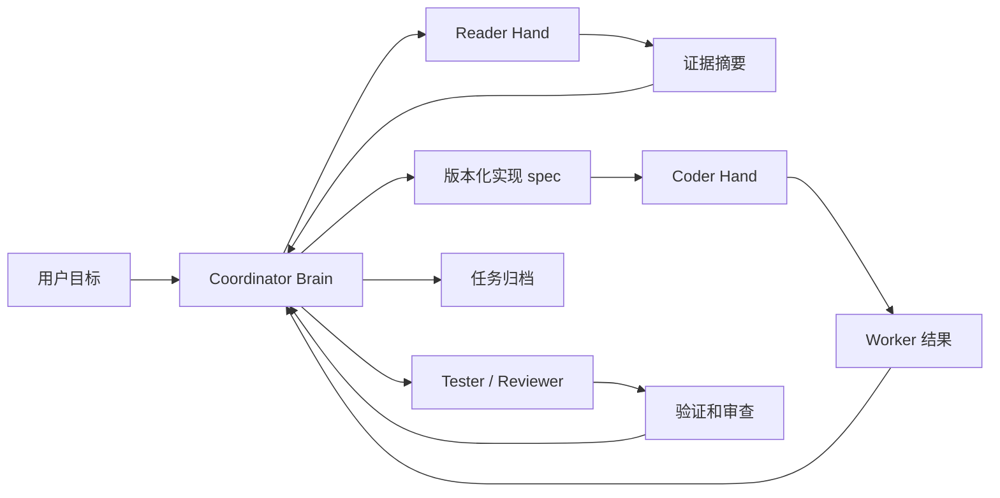

# MindHandsHarness

一种 protocol-first 的 managed agents 协同框架，用来把“主脑”和“手脚”分离。

[English README](README.md)

MindHandsHarness 是一个轻量级本地 harness，用于组织多 agent 编码工作流。它让一个模型担任 **Coordinator Brain**，负责规划、判断和管理；再把读取代码、实现修改、运行验证、代码审查和记忆整理交给隔离的 **Worker Hands**。

目标很简单：让主脑上下文保持干净，让 Worker 行为更明确，并留下可审计的任务轨迹。

> 当前状态：早期 protocol-first 项目。harness 已可用，但公开 API 和文件布局仍可能演进。

## 为什么需要 MindHandsHarness

普通 agent 编码会把规划、探索、编辑、测试都混在一个上下文里。小任务还好，任务一复杂，主脑就会读太多代码，执行细节挤占决策空间，之后也很难复盘“为什么这么做”。

MindHandsHarness 增加了一个小型控制层：

- **Coordinator Brain**：规划、决策、派发、总结。
- **Reader Hand**：收集证据，给出文件路径和行号。
- **Coder Hand**：严格执行冻结后的实现 spec。
- **Tester Hand**：验证行为，不改代码。
- **Reviewer Hand**：审查 scope、风险和 spec compliance。
- **Memory Curator**：提出长期记忆更新建议。

它不是替代你的编码 agent，而是给 agent 协作加上流程、边界和审计轨迹。

## 核心流程



## 提供什么

- 面向 human-in-the-loop agent team 的 protocol-first 工作流。
- 本地 CLI，管理 session、mission、task、spec、archive 和 health state。
- Coordinator、Reader、Coder、Tester、Reviewer、Memory Curator 的角色提示词。
- 版本化 implementation spec，避免 Worker 执行可变草稿。
- 每个 task 独立保存 prompt/result，多轮 Reader/Coder 不互相覆盖。
- JSONL session event，方便复盘。
- 核心 harness 行为的回归测试。

## 快速开始

检查状态：

```bash
python3 .harness/bin/harness.py status
```

启动任务：

```bash
python3 .harness/bin/harness.py start "Investigate and implement the requested change"
```

派发 Reader：

```bash
python3 .harness/bin/harness.py dispatch-role \
  --role Reader \
  --objective "Locate the files and current behavior relevant to the requested change" \
  --questions "Which file owns the behavior?; What are the exact insertion points?; What risks or unknowns remain?"
```

获取 Worker 启动指令：

```bash
python3 .harness/bin/harness.py worker-instructions
```

在新的 agent 窗口中粘贴打印出来的指令。Worker 回复 `Completed.` 后收集结果：

```bash
python3 .harness/bin/harness.py collect-role --role Reader
```

证据充分后创建并校验 spec：

```bash
python3 .harness/bin/harness.py write-spec
# 编辑 .harness/runtime/current/implementation_spec.md
python3 .harness/bin/harness.py spec-check
```

派发 Coder：

```bash
python3 .harness/bin/harness.py dispatch-role \
  --role Coder \
  --objective "Implement the checked implementation spec"
```

完成验证和审查后归档：

```bash
python3 .harness/bin/harness.py archive-current
```

## 健康任务周期

```text
start
  -> dispatch Reader
  -> worker-instructions
  -> collect Reader
  -> evidence sufficiency check
  -> write-spec
  -> edit implementation_spec.md
  -> spec-check
  -> dispatch Coder
  -> collect Coder
  -> dispatch Tester/Reviewer when needed
  -> archive-current
```

不确定下一步时运行 `status`。声称状态健康前运行 `doctor`。

## 文档

- [Quick Start](docs/quickstart.md)
- [快速开始](docs/quickstart.zh-CN.md)
- [Architecture](docs/architecture.md)
- [架构说明](docs/architecture.zh-CN.md)
- [Workflow Protocol](docs/workflow-protocol.md)
- [工作流协议](docs/workflow-protocol.zh-CN.md)
- [Open Source Release Checklist](docs/open-source-release-checklist.md)

## 图片资源

暂不包含图片资源。

计划稍后补充：

- 项目 icon / logo。
- 用于 README 和社交预览的流程图图片。

目前 README 使用 Mermaid 流程图，保持轻量且易修改。

## 开发验证

```bash
python3 .harness/test_harness_cli.py

PYTHONPYCACHEPREFIX=/tmp/mindhandsharness_pycache \
  python3 -m py_compile .harness/bin/harness.py .harness/test_harness_cli.py

python3 .harness/bin/harness.py doctor
```

## 许可证

MIT。见 [LICENSE](LICENSE)。

