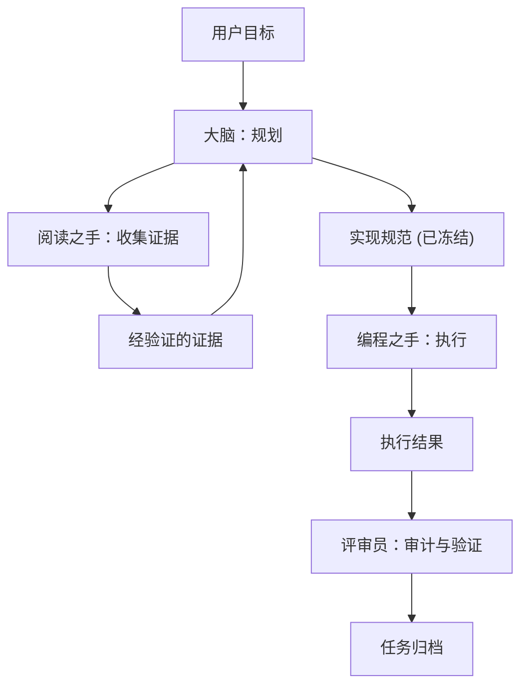

# MindHandsHarness

**协议优先的托管 Agent 框架：将“大脑”与“双手”彻底分离。**

[English](README.md)

MindHandsHarness 是一个轻量级的本地协议，旨在以手术般的精度运行多 Agent 编程工作流。通过在 **Coordinator Brain（负责规划与决策的大脑）** 与 **Worker Hands（负责阅读、编辑、测试的双手）** 之间建立严格的边界，防止模型上下文污染和逻辑混乱。

## 设计哲学

**上下文是有限的，而纪律是无限的。** 大多数 Agent 编程会话失败的原因在于模型沉溺于海量的日志、盲目的代码探索和繁杂的执行细节。

MindHandsHarness 通过以下方式解决这一问题：
1. **隔离性**：执行细节保留在 Worker 会话中，不污染主大脑的思考空间。
2. **证据先行**：在证据未经验证前，严禁修改任何代码。
3. **版本化规范**：每一次代码变更都必须遵循一个版本化、不可变的实现规范（Spec）。

## 核心角色

- **Coordinator Brain (协调大脑)**：定义目标、验证证据、编写 Spec 并审计结果。
- **Reader Hand (阅读之手)**：专门的侦察兵，负责收集代码行引用并回答精确的问题。
- **Coder Hand (编程之手)**：纯粹的执行角色，负责实现冻结的 Spec。不参与决策，只负责编码。
- **Tester/Reviewer (测试与评审)**：验证角色，确保“双手”严格执行了“大脑”的意图。

## 工作流循环

## 快速开始 (基于对话)

使用 MindHandsHarness 非常简单，就像平时聊天一样。你不需要学习复杂的 CLI 指令——AI 会自动为你处理协议。

1. **引入框架**：将本仓库复制到你的项目中。
2. **开启任务**：直接告诉 AI 你的目标，例如：*"使用 harness 协议重构登录逻辑。"*
3. **配合执行**：AI 会自动初始化 Mission，分派 Reader 进行调查，并在需要时引导你启动子 Agent。

## 目录结构

- `.harness/`：协议的核心，包含角色定义、状态管理和 CLI 逻辑。
- `AGENTS.md`：AI Agent 的入口指令文件。**请勿修改。**

