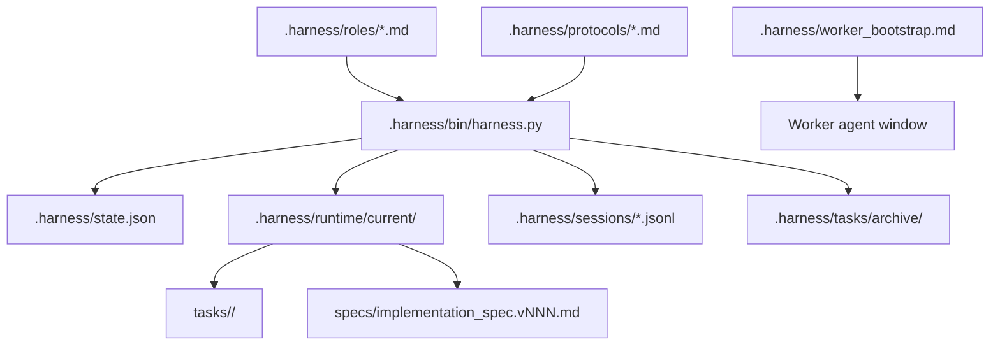

# Architecture

MindHandsHarness is intentionally small. It is a local file-backed control plane for multi-agent coding work.

## Components



## Coordinator Brain

The Coordinator is the only role allowed to turn evidence into implementation decisions. It should:

- Frame the user goal.
- Ask narrow Reader questions.
- Evaluate evidence sufficiency.
- Write and validate the implementation spec.
- Dispatch execution workers.
- Collect and interpret results.
- Decide whether to test, review, repeat, or archive.

The Coordinator may inspect a specific file or small code block only when the relevant file is known and the read has a narrow purpose.

## Worker Hands

Workers operate in separate one-shot sessions.

| Role | Purpose | Must Not Do |
| --- | --- | --- |
| Reader | Collect evidence and answer questions | Modify files or make strategic decisions |
| Coder | Implement the checked spec | Invent requirements, change defaults, expand scope |
| Tester | Verify behavior | Patch code |
| Reviewer | Audit diff and spec compliance | Modify code |
| Memory Curator | Propose long-term memory updates | Store unverified assumptions |

## Runtime Model

Each dispatch creates a unique task ID:

```text
T-YYYYMMDD-NNN
```

Task artifacts are stored under:

```text
.harness/runtime/current/tasks/<task_id>/
  <role>.task.md
  <role>.prompt.md
  <role>.result.md
```

The harness also writes the latest role prompt to:

```text
.harness/runtime/current/<role>.prompt.md
```

This keeps worker bootstrap simple while preserving historical artifacts.

## Spec Model

The active editable spec lives at:

```text
.harness/runtime/current/implementation_spec.md
```

`spec-check` validates required sections and creates a frozen snapshot:

```text
.harness/runtime/current/specs/implementation_spec.v001.md
.harness/runtime/current/specs/implementation_spec.v002.md
```

Workers should treat the checked spec as the source of truth.

## Event Log

Session events are JSONL files in:

```text
.harness/sessions/
```

Important event types include:

- `SESSION_START`
- `MISSION_START`
- `TASK_DISPATCH`
- `WORKER_RESULT`
- `SPEC_CREATED`
- `SPEC_READY`
- `AUTO_ARCHIVE`
- `MISSION_ARCHIVE`

## Archive Model

`archive-current` moves runtime artifacts into:

```text
.harness/tasks/archive/<mission_id>/
```

It also writes:

```text
mission_state.json
```

That file makes the archive auditable even after the active state is reset.

