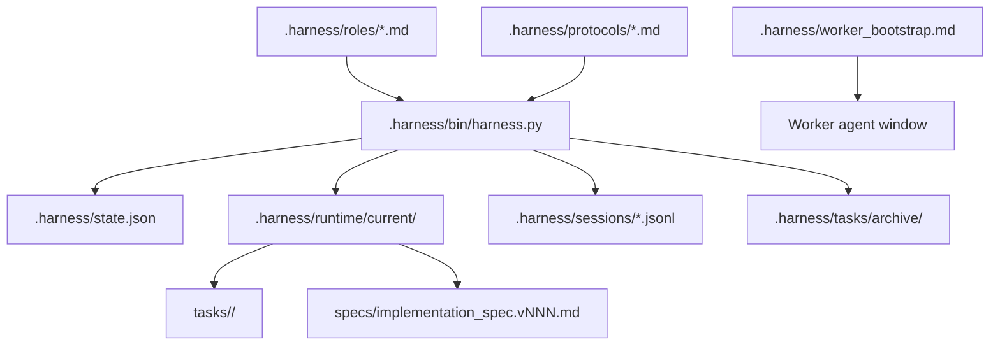

# 架构说明

MindHandsHarness 是一个很小的本地文件型控制层，用来组织多 agent 编码工作流。

## 组件



## Coordinator Brain

Coordinator 是唯一可以把证据转成实现决策的角色。它负责：

- 理解用户目标。
- 设计窄 Reader 问题。
- 判断证据是否充分。
- 编写并校验 implementation spec。
- 派发执行 Worker。
- 收集并解释 Worker 结果。
- 决定测试、审查、重试或归档。

Coordinator 可以读取少量关键源码，但前提是相关文件已明确，并且读取目的很窄，比如确认插入点、默认值或矛盾。

## Worker Hands

Worker 在独立的一次性会话中运行。

| Role | 目的 | 禁止事项 |
| --- | --- | --- |
| Reader | 收集证据并回答问题 | 修改文件或做战略决策 |
| Coder | 实现已校验 spec | 发明需求、改变默认行为、扩大范围 |
| Tester | 验证行为 | 修改代码 |
| Reviewer | 审查 diff 和 spec compliance | 修改代码 |
| Memory Curator | 提出长期记忆更新 | 存储未验证假设 |

## Runtime 模型

每次 dispatch 创建唯一 task ID：

```text
T-YYYYMMDD-NNN
```

Task 产物保存在：

```text
.harness/runtime/current/tasks/<task_id>/
  <role>.task.md
  <role>.prompt.md
  <role>.result.md
```

harness 也会把最新 role prompt 写到：

```text
.harness/runtime/current/<role>.prompt.md
```

这样既能保持 Worker bootstrap 简单，又能保留历史产物。

## Spec 模型

当前可编辑 spec 位于：

```text
.harness/runtime/current/implementation_spec.md
```

`spec-check` 会校验必需章节，并创建冻结快照：

```text
.harness/runtime/current/specs/implementation_spec.v001.md
.harness/runtime/current/specs/implementation_spec.v002.md
```

Worker 应把已校验 spec 当成唯一执行依据。

## Event Log

Session events 是 JSONL 文件：

```text
.harness/sessions/
```

重要事件类型：

- `SESSION_START`
- `MISSION_START`
- `TASK_DISPATCH`
- `WORKER_RESULT`
- `SPEC_CREATED`
- `SPEC_READY`
- `AUTO_ARCHIVE`
- `MISSION_ARCHIVE`

## Archive 模型

`archive-current` 会把运行态产物移动到：

```text
.harness/tasks/archive/<mission_id>/
```

并写入：

```text
mission_state.json
```

这样即使 active state 被重置，归档仍然可审计。

