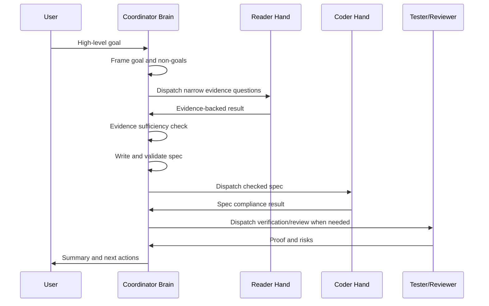

# Workflow Protocol

MindHandsHarness is built around one central rule:

```text
Evidence before spec. Spec before execution. Execution before review. Review before archive.
```

## Planning Loop



## Evidence Sufficiency Checklist

Before writing an implementation spec, the Coordinator should confirm:

- Target files are known.
- Exact insertion points are known.
- Current default behavior is known.
- Input and output formats are known.
- New parameters and defaults are known.
- Risks are identified.
- Verification method is clear.
- Unknowns are turned into assumptions, stop conditions, or user questions.

## Implementation Spec Rules

The spec must include:

- `Objective`
- `Scope`
- `Required Changes`
- `Evidence References`
- `Allowed Autonomy`
- `Must Not Decide`
- `Stop Conditions`

The Coder should stop if the spec leaves a critical business or behavior decision unspecified.

## Role Boundary Rules

Reader:

- Answers the questions asked.
- Provides evidence.
- Reports unknowns.
- Does not recommend architecture or implementation strategy.

Coder:

- Implements the checked spec.
- Reports deviations and assumptions.
- Stops on forbidden or unspecified decisions.

Tester:

- Runs verification.
- Reports commands and evidence.
- Does not patch code.

Reviewer:

- Audits diff, risks, and spec compliance.
- Reports required fixes.
- Does not modify code.

## When to Repeat

Repeat Reader when:

- The evidence does not identify exact files.
- Current behavior is unclear.
- Verification strategy is unknown.
- The requested behavior conflicts with existing code or docs.

Repeat Coder when:

- Reviewer finds a spec violation.
- Tester finds a failing behavior that is covered by the spec.
- The Coder reports a stop condition that the Coordinator can resolve with a spec update.

Ask the user when:

- The decision is product or business intent.
- The code cannot answer the question.
- Multiple valid behaviors exist and none is clearly safer.

