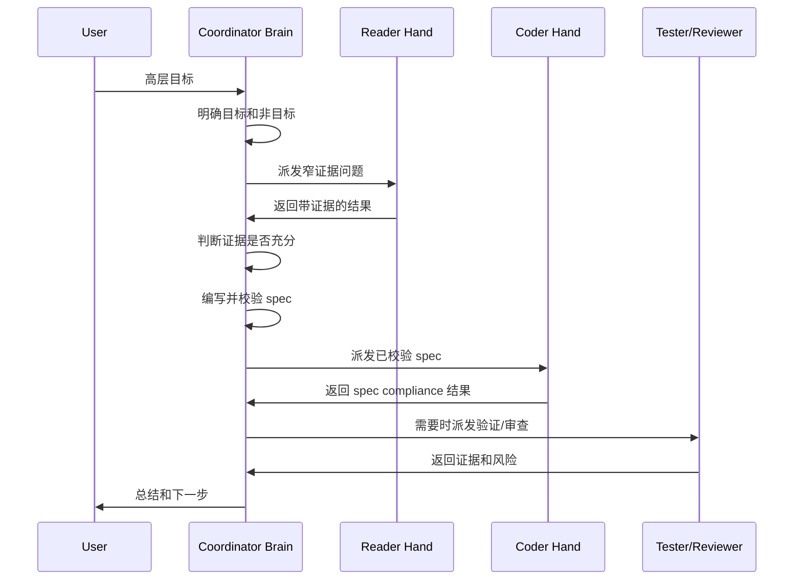

# 工作流协议

MindHandsHarness 的核心规则：

```text
先有证据，再写 spec。先有 spec，再执行。先执行，再验证。先验证，再归档。
```

## Planning Loop



## 证据充分性检查

写 implementation spec 前，Coordinator 应确认：

- 目标文件已明确。
- 插入点已明确。
- 当前默认行为已确认。
- 输入输出格式已确认。
- 新参数和默认值已确认。
- 风险已识别。
- 验证方法明确。
- 未知项已转成假设、Stop Conditions 或用户问题。

## Implementation Spec 规则

Spec 必须包含：

- `Objective`
- `Scope`
- `Required Changes`
- `Evidence References`
- `Allowed Autonomy`
- `Must Not Decide`
- `Stop Conditions`

如果 spec 缺少关键业务或行为决策，Coder 应停止并报告，而不是自行决定。

## Role 边界

Reader：

- 回答 Coordinator 提出的问题。
- 提供证据。
- 报告未知。
- 不提供架构或实现策略建议。

Coder：

- 执行已校验 spec。
- 报告偏离和假设。
- 遇到禁止或未定义决策时停止。

Tester：

- 运行验证。
- 报告命令和证据。
- 不修改代码。

Reviewer：

- 审查 diff、风险和 spec compliance。
- 报告必须修复的问题。
- 不修改代码。

## 什么时候重复

重复 Reader：

- 证据没有定位到确切文件。
- 当前行为不清楚。
- 验证策略不清楚。
- 用户期望和代码/文档冲突。

重复 Coder：

- Reviewer 发现 spec violation。
- Tester 发现 spec 覆盖的行为失败。
- Coder 报告了 Coordinator 可以通过更新 spec 解决的 stop condition。

询问用户：

- 决策属于产品或业务意图。
- 代码无法回答问题。
- 存在多个合理行为，而且没有明显更安全的默认选择。

